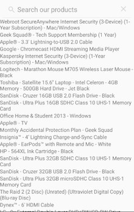
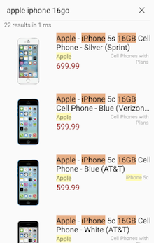

# Workshop Algolia @ Wild Code School
## Se concentrer sur l'Éxpérience Utilisateur grâce aux APIs: coder l'interface de recherche d'Amazon en quelques heures

> Atelier réalisé à Algolia pour l'école Wild Code School Toulouse

## Étape 1: chercher dans une liste de noms

- Prendre le template de projet

- Ajouter [InstantSearch Android](https://github.com/algolia/instantsearch-android)

- Créer la page de recherche

- Ajouter les premiers widgets: `SearchBox` et `Hits`

- Définir l'affichage des résultats

- Faire une première recherche

     

## Étape 2: afficher les détails des produits

- Afficher les autres attributs des produits

- Gérer les attributs éventuellement nuls

- Afficher des statistiques

          
## Étape 3: expliquer les résultats

- Utiliser le _highlighting_ dans les résultats

## Étape 4: configurer le moteur de recherche
- Définir comment le moteur doit chercher

- Configurer le classement des résultats
